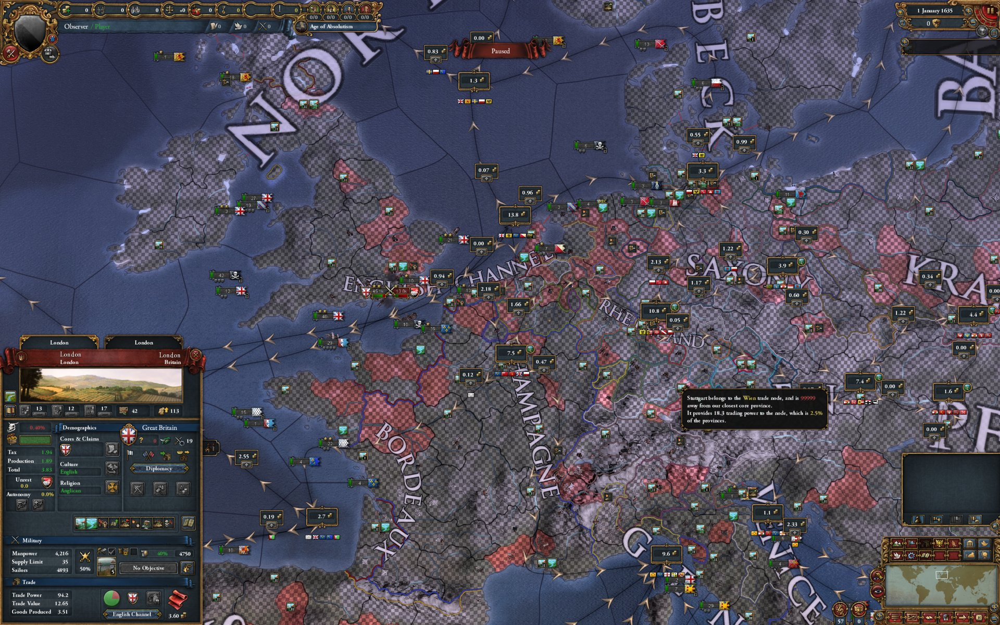
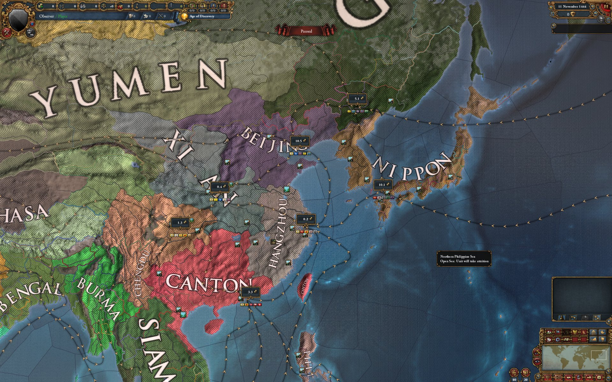
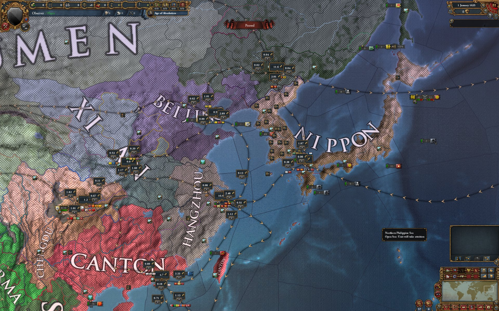

# EU4 Trade System Overhaul: Mare Liberum

*Davis Lee (rdavislee)*

**TL;DR:** Mare Liberum is a free trade overhaul for EU4 1.37.5. Every trade good gets its
own trade network, recomputed every in-game month from where the good is produced and where
the world's wealth sits, so trade can flow in any direction and the world's trade capitals
are earned, not scripted. Conquest captures producers, development pulls and pushes trade,
merchants can work either end of a link, and your capital does the collecting. The controls
stay vanilla's, with one decision fewer. Single-player, installs in two drops and a checkbox.
Download and docs:
[github.com/rdavislee/eu4-per-good-trade/releases](https://github.com/rdavislee/eu4-per-good-trade/releases/latest).

One sentence of backstory, since this is the internet: I've played EU since sixth grade, I
study computer science and economics at MIT, and I built this in the two weeks of August 2026
before my senior year. This mod exists because of the campaigns two thousand hours taught me
not to start.

I never wanted to play the Aztecs. Not because surviving Europe is hard (that's the fun
part), but because of what winning looked like. Say you do it: you reform, you hold, you
reconquer the New World. Now open the trade map. Mexico has outgoing arrows, and it will have
them forever, because the three places where trade *terminates* (the English Channel, Genoa
and Venice) were chosen before the game shipped, and no conquest on the planet adds a fourth.
You can win every war and Mexico still can never become the place the world's trade flows
*to*. **In Mare Liberum, an end is computed, not chosen.** Trade stops wherever concentrated
wealth out-pulls its neighbours. Win as the Aztecs, develop Mexico, and the world's trade can
genuinely terminate there: no mission, no mercy from a designer, just development and
geography.

Same story with colonial Japan. Cross the Pacific, take the coast, push inland, and the
continent turns its back on you: the Mississippi, the Ohio, the whole Atlantic side drains
east toward Europe, and nothing you do will ever turn it around. Even Nippon isn't allowed to
be a destination; it drains on to Hangzhou, and Hangzhou, eventually, to Europe. **Here,
supply flows to demand and nothing else.** There are no designer arrows to obey. Make Asia
the demand, and the American coast feeds Asia.

The frustrating part is that Paradox fixed everything *else*. Development and institutions
meant a Ming or a Vijayanagar could keep pace with Europe at home; reform tracks gave the
Aztecs and the Inca a fighting chance. Trade never got that patch, and it couldn't: the
arrows aren't a balance number you can tune, they're the architecture.

The thought I kept circling back to was the
Atlantic. Cloth crossed it westward while sugar crossed it eastward, on the same water, at
the same time. One directed graph cannot say that sentence. Twenty-nine can. **That's the
whole mod: a separate network for every trade good, re-derived every in-game month from two
facts about the actual world, where each good is made and where the wealth is.** The same
strait can carry cloth east and furs west at the same time.

Here is what that changes about how you play. **War changes meaning first.** In vanilla,
taking the spice province hands you its trade value and the arrows stay put. Here the arrows
answer to production: take the region that grows the spices and you hold the source of the
spice network itself, and the map carries that good toward whoever wants it most. Make sure
that's you. Painting the map bigger does nothing by itself, because a province's pull comes
from its development and land, not its flag. Conquest buys supply.

**Development is the other instrument, and it splits in two.** Base tax is pure demand: it
makes a place hungrier, and goods orient toward hunger. Base production is supply: it makes
the province a source, with some pull of its own, since goods are worth money. Same monarch
points as always, but the two buttons are now two different levers on the world's arrows.
Develop your capital region hard enough and the networks genuinely bend toward you; that is
how the English Channel earns terminus status in our test campaigns instead of being handed
it.

The second design rule: react to the
world, but play at vanilla's click budget. **Nothing is ever ordered per good.** Merchant
placement covers every good on that link end at once. The collect-or-steer choice is gone
entirely: your capital collects, merchants steer. Collecting abroad was only ever vanilla's
workaround for a one-way map that stranded value downstream of your home, and there is no
more downstream. You steer trade home from anywhere in reach instead. If you can play
vanilla trade, you already know the controls.

The AI plays the same board. On the Caribbean-Sevilla link in one test campaign, Portugal
steered goods like sugar toward Sevilla while Caraíbas, Portugal's own colonial nation,
steered goods like cloth from Sevilla back to the Caribbean. One link, two merchants,
opposite directions, a colonial economy running both ways with nobody scripting it. Across
the full run, half of the AI's merchant placements sat on reverse ends.

*The cloth network in 1635: producers lit, everyone else dimmed.*

**And the map shows you all of it.** Click a province in the trade mapmode and the entire
trade UI becomes that good's map: its own arrows, its own numbers, its own sinks. That view
is where the strategy comes from. You see where your good actually goes, who is pulling it,
and which end of which link a merchant should work; the good you are about to go to war for
stops being a line in a tooltip and becomes a network you can read.

It went design spec first, attacked
until nearly every number in it was measured against the real game. The algorithm is a supply
and demand flow model: every month, each good is routed as a flow from the provinces that
produce it to the wealth that can pay for it, and the direction of every link on the map falls
out of that solve. The finished model lives in a DLL that reads the running game's
memory once a month, solves every network, and writes the answers back into the engine's own
structures, so the ledger, the tooltips and the AI all see the real economy, not a shadow of
one.

The proof is a campaign nobody played: 1444 into the 1600s, hands-off, AI only.

|  |  |
|---|---|
| *1444: the East's flows converge on Hangzhou.* | *The same region in 1635: the terminus has moved to Nippon.* |

At the start the world drains to Genoa and Hangzhou. By the 1600s the ends had moved to the
English Channel, the Rhineland and Nippon: Britain developed until the Channel out-pulled
everything around it, and when China split and Wu, Shun and Yue went to war, the east lost
its sink to the fighting. The Channel became what vanilla always scripted it to be, except
this time nobody scripted it. And out on the Atlantic, sugar sailed east while cloth sailed
west, on the same water, at the same time. The sentence vanilla couldn't say, spoken by the
AI on its own.

The world total tracks vanilla.

The fine print: EU4 **1.37.5** exactly (Steam, Windows, single-player). The model lives in a
`version.dll` that sits next to `eu4.exe`, which is why it can't be uploaded to the Steam
Workshop; it lives on GitHub instead. Your antivirus may side-eye it, and the build is
bit-reproducible so you can build it yourself and verify the hash instead of trusting me.
Installation steps and the rest of the documentation are in the repo:
**[github.com/rdavislee/eu4-per-good-trade](https://github.com/rdavislee/eu4-per-good-trade)**.

The name is from Grotius: *Mare Liberum*, "The Free Sea," the 1609 argument that the sea and
its trade belong to no one. Vanilla shipped a closed sea. This opens it.

Davis