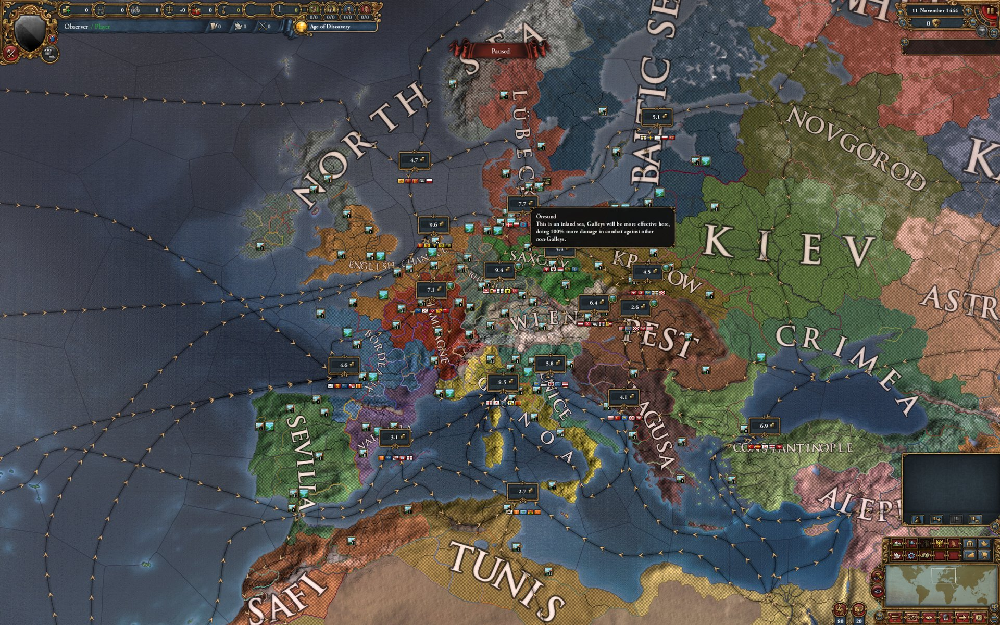
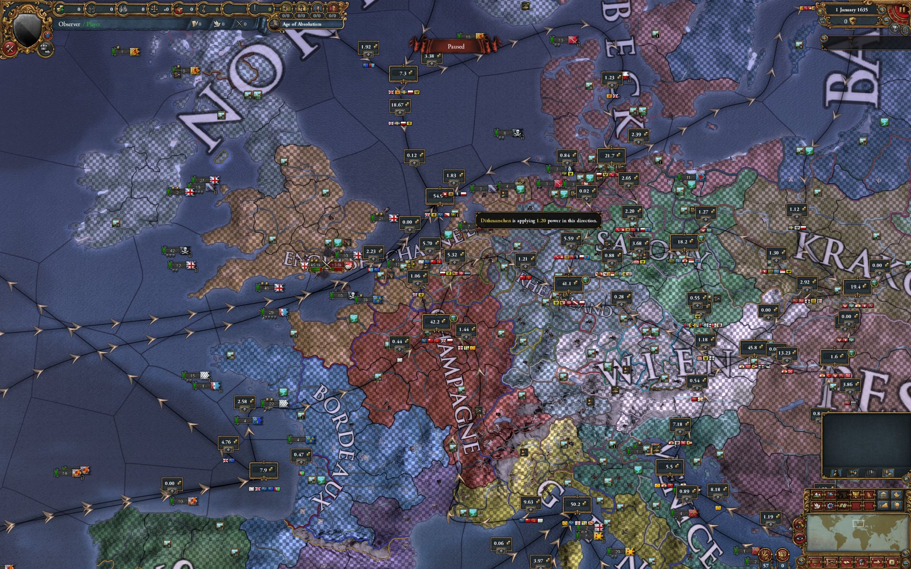

# EU4 Trade System Overhaul: Mare Liberum

**TL;DR:** Free trade overhaul for EU4 1.37.5. Every trade good gets its own trade network,
recomputed every in-game month from where the good is produced and where the world's wealth
sits, so trade can flow in any direction and the world's trade capitals are earned, not
scripted. The controls stay vanilla's. Single-player, installs in two drops and a checkbox.
Download:
[github.com/rdavislee/eu4-per-good-trade/releases](https://github.com/rdavislee/eu4-per-good-trade/releases/latest).

In vanilla you can win every war as the Aztecs and Mexico still can never become a place the
world's trade flows *to*. The three nodes where trade terminates (the English Channel, Genoa,
Venice) were picked before the game shipped, and no conquest on the planet adds a fourth.
Colonize the American east coast as Japan and the continent drains east toward Europe anyway,
forever. Paradox patched everything else over the years, development, institutions, reform
tracks, but the arrows were never a number they could tune. They're the architecture.

Mare Liberum replaces the architecture. The design problem: cloth crossed the Atlantic
westward while sugar crossed it eastward, on the same water, at the same time, and one
directed graph cannot say that. Twenty-nine can. **Every good gets its own network,
re-derived monthly from where it's made and where the wealth is.** Trade ends wherever
concentrated wealth out-pulls its neighbours. Develop Mexico and the world's trade can
genuinely terminate there. No mission, no mercy from a designer.

## What changes in play

- **Conquest captures supply.** A province pulls trade the same no matter whose flag is on
  it, so painting the map bigger doesn't bend the arrows toward you. What conquest gets you is
  the source: take the region that grows the spices and you hold where the spice network
  starts, and the map carries the good toward whoever wants it most.
- **Development is two levers.** Base tax is demand: it makes a place hungrier, and goods
  orient toward hunger. Base production is supply: it makes the province a source. Develop
  your capital region hard enough and the networks bend toward you.
- **Merchants work both ends of a link.** Your capital collects; merchants steer, including
  against the prevailing current. In one test run Portugal steered sugar toward Sevilla while
  Caraíbas, its own colonial nation, steered cloth back across the same link to the
  Caribbean. The AI plays the reverse board unprompted: half its merchant placements sit on
  ends that in vanilla do not exist at all.
- **Nothing is ever ordered per good.** A merchant covers every good on its link end at once.
  If you can play vanilla trade, you already know the controls.

*Click a province and the entire trade UI becomes that good's map: its own arrows, numbers
and sinks. You see where your good actually goes, who is pulling it, and which end of which
link a merchant should work.*

## The proof

I play it myself; the headline evidence is deliberately not my play. It's a hands-off
observer run, 1444 into the 1600s, AI only, so nothing in the result is steered or
cherry-picked: the system has to produce history-shaped trade on its own.

|  |  |
|---|---|
| *1444: Europe drains to Genoa.* | *1635: the terminus has moved to the English Channel.* |

It did. Britain developed until the Channel out-pulled everything around it, and the
Mediterranean-to-Atlantic shift that actually happened, the one vanilla hardcodes from day
one, emerged on its own.

|  |  |
|---|---|
| *1444: the East's flows converge on Hangzhou.* | *The same region in 1635: the terminus has moved to Nippon.* |

The East moved too: when China split into warring states, the fighting cost it its sink, and
the terminus crossed the sea to Nippon. Out on the Atlantic, sugar sailed east while cloth
sailed west at the same time. And the world total tracks vanilla throughout, because the mod
redraws where trade flows, not how much of it the world produces.

## The fine print

EU4 **1.37.5** exactly, Steam, Windows, single-player. That is the last patch EU4 will ever
get, which turns the version lock into a feature: the game under this mod is done moving, so
the mod does not rot. The model is a DLL beside `eu4.exe`
that solves every network once a month and writes the results into the engine's own
structures, so the ledger, the tooltips and the AI all see the real economy. That is also why
it can't go on the Steam Workshop, and why your antivirus may side-eye it: the build is
bit-reproducible, so you can build it yourself and verify the hash instead of trusting me.
Install steps and the rest of the documentation:
**[github.com/rdavislee/eu4-per-good-trade](https://github.com/rdavislee/eu4-per-good-trade)**.

The name is from Grotius: *Mare Liberum*, "The Free Sea," the 1609 argument that the sea and
its trade belong to no one. Vanilla shipped a closed sea. This opens it.
